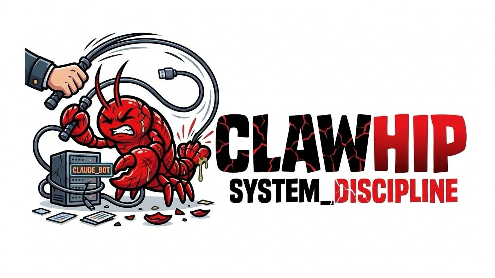

# clawhip

<p align="center">
  
</p>

<p align="center">
  <a href="https://crates.io/crates/clawhip"></a>
  <a href="https://github.com/Yeachan-Heo/clawhip/stargazers"></a>
</p>

> **⭐ Star this repo before using clawhip.** The installer will star it automatically if you have `gh` CLI authenticated.

This is a standalone Discord bot / system daemon that whips your claw into organized contextual notifications.

Human install pitch:

```text
Just tag @openclaw and say: install this https://github.com/Yeachan-Heo/clawhip
```

Then OpenClaw should:
- clone the repo
- run `install.sh`
- read `SKILL.md` and attach the skill
- scaffold config / presets
- start the daemon
- run live verification for issue / PR / git / tmux / install flows

## Good to use together

clawhip pairs well with coding session tools that run in tmux:

### [OMX (oh-my-codex)](https://github.com/Yeachan-Heo/oh-my-codex)

OpenAI Codex wrapper with auto-monitoring. Launch monitored coding sessions:

```bash
clawhip tmux new -s issue-123 \
  --channel YOUR_CHANNEL_ID \
  --mention "<@your-user-id>" \
  --keywords "error,PR created,complete" \
  -- 'source ~/.zshrc && omx --madmax'

# or attach monitoring to an existing tmux session
clawhip tmux watch -s issue-123 \
  --channel YOUR_CHANNEL_ID \
  --mention "<@your-user-id>" \
  --keywords "error,PR created,complete"
```

See [`skills/omx/`](skills/omx/) for ready-to-use scripts.

### [OMC (oh-my-claudecode)](https://github.com/Yeachan-Heo/oh-my-claudecode)

Claude Code wrapper with auto-monitoring. Launch monitored coding sessions:

```bash
clawhip tmux new -s issue-456 \
  --channel YOUR_CHANNEL_ID \
  --mention "<@your-user-id>" \
  --keywords "error,PR created,complete" \
  -- 'source ~/.zshrc && omc --openclaw --madmax'
```

See [`skills/omc/`](skills/omc/) for ready-to-use scripts.

## Description

Operational spec for OpenClaw / Clawdbot agents consuming this repo.

Repo role:
- executable/runtime repo
- daemon-first Discord notification gateway
- built-in GitHub/git/tmux monitoring runtime
- route/filter/message-render engine
- lifecycle surface: install / update / uninstall / start / status

Attachment model:
- repo = runtime
- `SKILL.md` = attach/install/usage instructions for OpenClaw / Clawdbot
- README = agent-facing operational spec

Default daemon endpoint:
- `http://127.0.0.1:25294`

## OpenClaw install contract

Primary install entrypoint:

```text
@openclaw install <repo_url>
```

Expected downstream automation behavior:

1. clone repo
2. run `./install.sh`
3. read `SKILL.md`
4. attach skill
5. scaffold config / presets
6. start daemon
7. run live verification

Reference repo URL:

```text
https://github.com/Yeachan-Heo/clawhip
```

## Discord bot setup

> **Recommended:** Create a dedicated Discord bot for clawhip. Do not reuse your Clawdbot / OpenClaw bot token.

clawhip sends high-volume notifications (commits, PRs, tmux keyword alerts, stale warnings). Using a separate bot keeps these cleanly separated from your AI chat bot.

1. Create a new bot at [Discord Developer Portal](https://discord.com/developers/applications) (e.g. "CCNotifier")
2. Copy the bot token
3. Invite to your server with **Send Messages** permission
4. Set the token in config:

```toml
[discord]
token = "your-dedicated-clawhip-bot-token"
default_channel = "your-default-channel-id"
```

## System model

```text
[input] -> [clawhip daemon :25294] -> [route/filter/preset render] -> [Discord REST delivery]
```

Input sources:
- CLI thin clients
- GitHub webhooks
- built-in git monitor
- built-in tmux monitor
- `clawhip tmux new` registration path

## Input -> behavior -> verification

### 1. Custom client event

Input:
```bash
clawhip send --channel <id> --message "text"
```

Behavior:
- POST to daemon `/api/event`
- daemon routes event
- Discord message emitted

Verification:
- `clawhip status`
- inspect configured Discord channel for rendered payload

### 2. GitHub issue preset family

Input:
- GitHub webhook `issues.opened`
- built-in GitHub issue monitor detection
- CLI thin client `clawhip github issue-opened ...`

Behavior:
- emit `github.issue-opened`
- route via `github.*`
- apply repo filter
- prepend route mention if configured
- send to Discord

Verification:
- create real issue
- confirm final Discord body contains:
  - repo
  - issue number
  - title
  - mention when configured

### 3. GitHub issue commented preset

Input:
- GitHub webhook `issue_comment.created`
- built-in GitHub issue monitor comment delta

Behavior:
- emit `github.issue-commented`
- route via `github.*`
- apply repo filter
- prepend route mention if configured

Verification:
- add real issue comment
- confirm final Discord message body in target channel

### 4. GitHub issue closed preset

Input:
- GitHub webhook `issues.closed`
- built-in GitHub issue monitor state transition

Behavior:
- emit `github.issue-closed`
- route via `github.*`
- apply repo filter
- prepend route mention if configured

Verification:
- close real issue
- confirm final Discord message body in target channel

### 5. GitHub PR preset family

Input:
- GitHub webhook `pull_request.*`
- built-in PR monitor state changes
- CLI thin client `clawhip github pr-status-changed ...`

Behavior:
- emit `github.pr-status-changed`
- route via `github.*`
- apply repo filter
- prepend route mention if configured

Verification:
- open real PR
- merge / close PR
- confirm final Discord message body in target channel

### 6. Git commit preset family

Input:
- built-in git monitor polling local repo
- CLI thin client `clawhip git commit ...`

Behavior:
- emit `git.commit`
- route through git/github family matching
- preserve repo-based route filtering
- prepend route mention if configured

Verification:
- create real empty commit in monitored repo
- confirm final Discord body contains commit summary and mention

### 7. Agent lifecycle preset family

Input:
```bash
clawhip agent started --name worker-1 --session sess-123 --project my-repo
clawhip agent blocked --name worker-1 --summary "waiting for review"
clawhip agent finished --name worker-1 --elapsed 300 --summary "PR created"
clawhip agent failed --name worker-1 --error "build failed"
```

Behavior:
- emit `agent.started`, `agent.blocked`, `agent.finished`, or `agent.failed`
- route via `agent.*`
- apply optional project/session filters
- include status / elapsed / summary / error details in rendered messages
- prepend route mention if configured

Verification:
- send each CLI event against a running daemon
- confirm final Discord body contains agent name and lifecycle state
- confirm `agent.*` route rules match each event type

### 8. tmux keyword preset

Input:
- built-in tmux monitor detects configured keyword
- CLI thin client `clawhip tmux keyword ...`

Behavior:
- emit `tmux.keyword`
- route via `tmux.*`
- prepend route mention if configured

Verification:
- print configured keyword in real monitored tmux session
- confirm final Discord body in target channel

### 9. tmux stale preset

Input:
- built-in tmux stale detection
- CLI thin client `clawhip tmux stale ...`

Behavior:
- emit `tmux.stale`
- route via `tmux.*`
- prepend route mention if configured

Verification:
- let real tmux session idle past threshold
- confirm final Discord body in target channel

### 10. tmux wrapper / watch preset

Input:
```bash
clawhip tmux new -s <session> \
  --channel <id> \
  --mention '<@id>' \
  --keywords 'error,PR created,FAILED,complete' \
  --stale-minutes 10 \
  --format alert \
  --shell /bin/zsh \
  -- command args

clawhip tmux watch -s <existing-session> \
  --channel <id> \
  --mention '<@id>' \
  --keywords 'error,PR created,FAILED,complete' \
  --stale-minutes 10 \
  --format alert
```

Behavior:
- `tmux new` creates a tmux session using the user's default shell (or `--shell` override)
- `tmux new` sends the requested command into the session
- `tmux watch` attaches monitoring to an already-running tmux session
- both commands register the session with the daemon
- daemon monitors keyword/stale events
- final delivery goes through daemon routing

Verification:
- run wrapper or watch an existing session
- emit keyword in pane
- confirm Discord message body and mention

### 11. install lifecycle preset

Input:
```bash
./install.sh
clawhip install
clawhip update --restart
clawhip uninstall --remove-systemd --remove-config
```

Behavior:
- install binary from git clone
- ensure config dir exists
- optional systemd install
- update rebuilds/reinstalls and optionally restarts daemon
- uninstall removes runtime artifacts

Verification:
- `clawhip --help`
- `clawhip status`
- `systemctl status clawhip` when systemd-enabled

## Preset event families

### GitHub family
- `github.issue-opened`
- `github.issue-commented`
- `github.issue-closed`
- `github.pr-status-changed`

### Git family
- `git.commit`
- `git.branch-changed`

### Agent family
- `agent.started`
- `agent.blocked`
- `agent.finished`
- `agent.failed`

### tmux family
- `tmux.keyword`
- `tmux.stale`

## Route contract

Config file:

```text
~/.clawhip/config.toml
```

Route model:

```toml
[[routes]]
event = "github.*"
filter = { repo = "clawhip" }
channel = "1480171113253175356"
mention = "<@1465264645320474637>"
format = "compact"
allow_dynamic_tokens = false

[[routes]]
event = "agent.*"
filter = { project = "clawhip" }
channel = "1480171113253175356"
format = "alert"
allow_dynamic_tokens = false
```

Resolution rules:
1. event family match
2. payload filter match
3. route channel / format / template / mention applied
4. default fallback used if route fields absent

## Dynamic token contract

Only for routes with:

```toml
allow_dynamic_tokens = true
```

Supported tokens:
- `{repo}`
- `{number}`
- `{title}`
- `{session}`
- `{keyword}`
- `{sh:...}`
- `{tmux_tail:session:lines}`
- `{file_tail:/path:lines}`
- `{env:NAME}`
- `{now}`
- `{iso_time}`

Safety:
- allowlisted token kinds only
- route-level opt-in only
- short timeout
- output cap

## Install surface

### From crates.io

```bash
cargo install clawhip
```

Published at [crates.io/crates/clawhip](https://crates.io/crates/clawhip). Requires Rust toolchain.

### Prebuilt binary installer (recommended, no Rust needed)

```bash
curl --proto '=https' --tlsv1.2 -LsSf https://github.com/Yeachan-Heo/clawhip/releases/latest/download/clawhip-installer.sh | sh
```

This installs the latest prebuilt `clawhip` binary from GitHub Releases into `$CARGO_HOME/bin` (typically `~/.cargo/bin`).

Release artifacts are generated for these Rust target triples: `x86_64-unknown-linux-gnu`, `aarch64-unknown-linux-gnu`, `x86_64-apple-darwin`, `aarch64-apple-darwin`, and `x86_64-pc-windows-msvc`.

### Repo-local install

```bash
./install.sh
./install.sh --systemd
```

`install.sh` now tries the latest prebuilt release first and falls back to `cargo install --path . --force` when a matching release asset is unavailable. If Cargo is needed for the fallback path but not installed, the script prints Rustup setup instructions. When `--systemd` is used, the installed binary is also copied to `/usr/local/bin/clawhip` so the bundled service unit can start it.

### Runtime lifecycle commands

```bash
clawhip install
clawhip install --systemd
clawhip update --restart
clawhip uninstall
clawhip uninstall --remove-systemd --remove-config
```

## systemd contract

Unit file:

```text
deploy/clawhip.service
```

Expected install path:
- copy to `/etc/systemd/system/clawhip.service`
- `systemctl daemon-reload`
- `systemctl enable --now clawhip`

## Live verification runbook

Use:
- `docs/live-verification.md`
- `scripts/live-verify-default-presets.sh`

Required live sign-off presets:
- issue opened
- issue commented
- issue closed
- PR opened
- PR status changed
- PR merged
- git commit
- agent started / blocked / finished / failed
- tmux keyword
- tmux stale
- tmux wrapper
- tmux watch
- install/update/uninstall

## Minimal operational commands

```bash
clawhip                 # start daemon
clawhip status          # daemon health
clawhip config          # config management
clawhip send ...        # thin client custom event
clawhip github ...      # thin client GitHub event
clawhip git ...         # thin client git event
clawhip agent ...       # thin client agent lifecycle event
clawhip tmux ...        # thin client / wrapper surface
```

